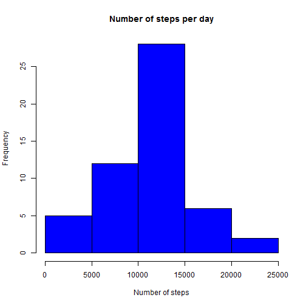
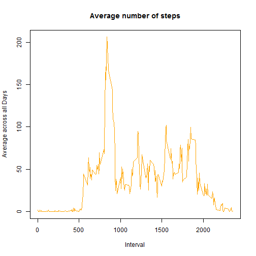
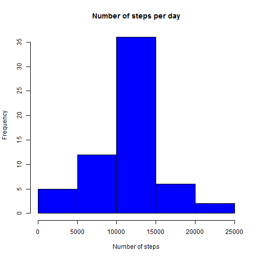
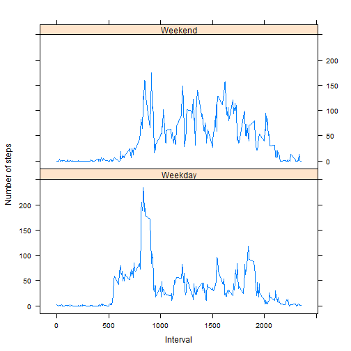

---
title: "Reproducible Research: Peer Assessment 1"
output:
  html_document:
    keep_md: true
---  


## Loading and preprocessing the data  

###1. Loading the data

The code for reading the data is as follows:


```r
mydata <- read.csv("D:/COURSERA/Data Science/R Working Directory/activity.csv")
head(mydata)
```

```
##   steps       date interval
## 1    NA 2012-10-01        0
## 2    NA 2012-10-01        5
## 3    NA 2012-10-01       10
## 4    NA 2012-10-01       15
## 5    NA 2012-10-01       20
## 6    NA 2012-10-01       25
```
###2.Processing the data

If we check the class of the date column,

```r
class(mydata$date)
```

```
## [1] "factor"
```
we see that it's a factor. We then need to coerce the data column to be an object of class Date in R

```r
mydata$date <- as.Date(mydata$date)
class(mydata$date)
```

```
## [1] "Date"
```


## Calculating the mean total number of steps taken per day

Let's first calculate the total number of steps per day


```r
Total_steps <- aggregate(steps ~ date, mydata, sum, na.rm = TRUE)
head(Total_steps)
```

```
##         date steps
## 1 2012-10-02   126
## 2 2012-10-03 11352
## 3 2012-10-04 12116
## 4 2012-10-05 13294
## 5 2012-10-06 15420
## 6 2012-10-07 11015
```

Let's now calculate the mean total number of steps per day


```r
mean(Total_steps$steps)
```

```
## [1] 10766.19
```

So we can see that the mean total number of steps taken per day is roughly 10766.

####Histogram of the total number of steps taken each day.


```r
hist(Total_steps$steps, main = "Number of steps per day", xlab = "Number of steps", col = "blue")
```

 

The median total number of steps taken per day is


```r
median(Total_steps$steps)
```

```
## [1] 10765
```

The median is 10765

## Determining the average daily activity pattern  


####1. Making a time series plot of the 5-minute interval and the average number of steps taken, averaged across all days 


```r
steps_in_interval <- tapply(mydata$steps, mydata$interval, mean, na.rm = TRUE)
plot(row.names(steps_in_interval), steps_in_interval, type = "l", xlab = "Interval", ylab = "Average across all Days", main = "Average number of steps", col = "orange")
```

 

####2. Determining the 5-minute interval, on average across all the days in the dataset, which contains the maximum number of steps


```r
max <- which.max(steps_in_interval)
names(max)
```

```
## [1] "835"
```

## Imputing missing values

####1. Calculating the total number of missing values in the dataset


```r
sum(is.na(mydata))
```

```
## [1] 2304
```

####2. Filling in the missing values with the mean total number of steps in a 5-min interval


```r
mean_steps <- aggregate(steps ~ interval, data = mydata, FUN = mean)
fill_in_NA <- numeric()
for (i in 1:nrow(mydata)) {
    row_i <- mydata[i, ]
    if (is.na(row_i$steps)) {
        steps <- subset(mean_steps, interval == row_i$interval)$steps
    } else {
        steps <- row_i$steps
    }
    fill_in_NA <- c(fill_in_NA, steps)
}
```

####3. Creating a new dataset that is equal to the original dataset but with the missing data filled in.


```r
new_dataset <- mydata
new_dataset$steps <- fill_in_NA
```

####4. Histogram of the total number of steps taken each day


```r
Total_steps1 <- aggregate(steps ~ date, data = new_dataset, sum, na.rm = TRUE)
hist(Total_steps1$steps, main = "Number of steps per day", xlab = "Number of steps", col = "blue")
```

 

```r
mean(Total_steps1$steps)
```

```
## [1] 10766.19
```

```r
median(Total_steps1$steps)
```

```
## [1] 10766.19
```
After replacing the NAs, the mean is the same, which is logical because we removed the NAs before calculating the mean, but the median is a little bit different from its initial value. So we can say that inputing missing data changes the median total daily number of steps.


## Are there differences in activity patterns between weekdays and weekends?

####1. Creating the factor variable that indicates whether a given date is a weekday or weekend day.


```r
mydata$date <- as.Date(mydata$date)
days <- weekdays(mydata$date)
level_days <- vector()
for (i in 1:nrow(mydata)) {
    if (days[i] == "samedi") {
        level_days[i] <- "Weekend"
        }
        else if (days[i] == "dimanche") {
        level_days[i] <- "Weekend"
    } 
        else {
        level_days[i] <- "Weekday"
    }
}
mydata$level_days <- level_days
mydata$level_days <- factor(mydata$level_days)

DailySteps <- aggregate(steps ~ interval + level_days, data = mydata, mean)
names(DailySteps) <- c("interval", "level_days", "steps")
```

####2. Panel Plot


```r
library(lattice)
xyplot(steps ~ interval | level_days, DailySteps, type = "l", layout = c(1, 2), xlab = "Interval", ylab = "Number of steps")
```

 
